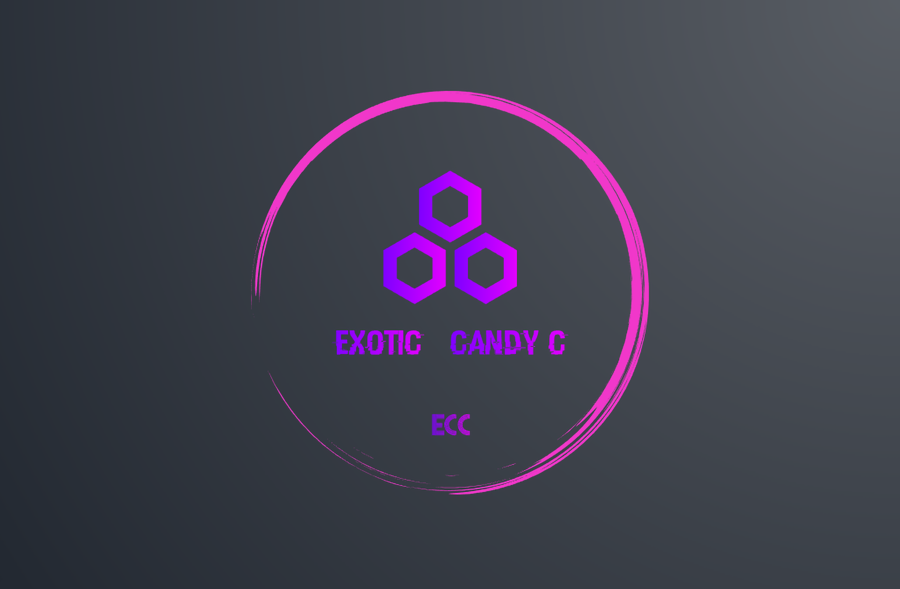

<h1 align="center">ExoticCandy C Collection</h1>
<h3 align="center">Shared C library for the common needs of any C projects</h3>
<h4 align="center">Free and Open Source library, used in all ECC softwares</h4>
<br />
<p align="center">
<a href="https://github.com/ExoticCandyC/eclibc/blob/master/LICENSE"></a>
<a href="#"></a>
<a href="#"></a>
</p>
<p align="center">
<a href="https://archlinux.org"></a>
<a href="https://github.com/espressif/esp-idf"></a>
<a href="https://www.microchip.com/en-us/education/developer-help/learn-tools-software/mcu-mpu/compilers/xc16"></a>
</p>
<p align="center">
<a href="https://github.com/ExoticCandyC/eclibc/releases"></a>
<a href="#"></a>
<a href="#"></a>
<a href="https://github.com/ExoticCandyC/eclibc/issues?q=is%3Aopen"></a>
<a href="https://github.com/ExoticCandyC/eclibc/issues"></a>
<a href="https://github.com/ExoticCandyC/eclibc/graphs/commit-activity"></a>
</p>

## Table of contents
🔸 [Brief description](#brief-description) \
🔸 [Dependencies](#dependencies) \
🔸 [Installation](#installation) \
🔸 [Documentation](#documentation) \
🔸 [Benchmark tools](#benchmark) 


## Brief description

**eclibc** is a C library, containing everyday use functions implemented in ANSI C language. This library can be compiled by most 16bit, 32bit and 64bit compilers, including:

**Computer targets:**<br />
<a href="https://gcc.gnu.org" style="text-decoration:none;">🔹 GCC</a><br />
<a href="https://clang.llvm.org/" style="text-decoration:none;">🔹 Clang</a><br />
<a href="https://bellard.org/tcc/" style="text-decoration:none;">🔹 TCC</a><br />
<a href="https://www.intel.com/content/www/us/en/developer/tools/oneapi/dpc-compiler.html" style="text-decoration:none;">🔹 ICC</a><br />
<a href="https://www.mingw-w64.org/" style="text-decoration:none;">🔹 MinGW32-GCC</a><br />

**Espressif targets:**<br />
<a href="https://docs.espressif.com/projects/esp-idf/en/latest/esp32/api-guides/tools/idf-tools.html" style="text-decoration:none;">🔸 xtensa-esp32-elf-gcc</a><br />
<a href="https://docs.espressif.com/projects/esp-idf/en/latest/esp32/api-guides/tools/idf-tools.html" style="text-decoration:none;">🔸 xtensa-esp32s2-elf-gcc</a><br />
<a href="https://docs.espressif.com/projects/esp-idf/en/latest/esp32/api-guides/tools/idf-tools.html" style="text-decoration:none;">🔸 xtensa-esp32s2-elf-gcc</a><br />

**Micochip© micro-processor units:**<br />
<a href="https://www.microchip.com/en-us/education/developer-help/learn-tools-software/mcu-mpu/compilers/xc16" style="text-decoration:none;">🔸 xc16-gcc</a><br />
<a href="https://www.microchip.com/en-us/education/developer-help/learn-tools-software/mcu-mpu/compilers/xc32" style="text-decoration:none;">🔸 xc32-gcc</a><br />


## Dependencies

💠️ git: used to clone the repository<br />
💠️ cmake: used to generate the make scripts<br />
💠️ A C compiler of choice<br />
<br />

## Installation

This package will soon be added to Arch AUR. But the standard installation process appliees to this library:

```bash
git clone --depth=1 https://github.com/ExoticCandyC/eclibc.git
cd eclibc
./configure
make
sudo make install
```

Please note that in order to use non-standard C compilers, you should manually introduce the compiler of choice to the CMakeLists.txt file.

Basically since the library is targeted for C89 (ANSI) standard, and compiled using heavy warning eliminations and pedantic syntax, this source code should basically be able to be compiled with any compiler that contains C89 standard functions.

As an example, Micochip© XC8 doesn't have an implementation of "free" and "malloc" functions. So it will produce errors during compilation.

The testings and developements are done on:<br />
&nbsp;&nbsp;&nbsp;&nbsp;&nbsp;&nbsp;1️⃣ Arch Linux and Gentoo Linux, on X86-64 architecture, using GCC, Clang and TCC compilers.<br />
&nbsp;&nbsp;&nbsp;&nbsp;&nbsp;&nbsp;2️⃣ Arch Linux, using xtensa-esp32-elf-gcc compiler for ESP32 target.<br />
&nbsp;&nbsp;&nbsp;&nbsp;&nbsp;&nbsp;3️⃣ Arch Linux, using Micochip© XC16 for PIC24FJ256GA106 micro-controller unit and dsPIC33CK256MP406 micro-controller unit.<br />
&nbsp;&nbsp;&nbsp;&nbsp;&nbsp;&nbsp;4️⃣ Gentoo Linux on Raspberry Pi 4.<br />

Since the standard C protocols are being followed, and CMake is available on most platforms, one should easily be able to compile this library on any other target including FreeBSD, OpenBSD, OSX. 

As of August 2022, there are no plans to enable official support for Microsoft Windows®. But generally speaking, making the library compatible with MinGW32-GCC is a future goal and that would enable the unofficial support for Microsoft Windows® targets.

## Documentation

Wiki pages are planned to be added to the git repository, and an official website is planned to be generated that will host a begginer friendly C tutorial, beginner friendly C++ tutorial and a comprehensive guide on how to use eclibc in both C and C++<br />
Considering my tight schedule and the fact that this project is a solo project, there is no expected date for the aforementioned documentations.


## Benchmark tools

This library is packed with benchmarking tools.

<h4 align="center">Compare module</h4>

You can compare the execution time of two functions using the built-in "ec_performance_compare" function.

Following is an example of how to use the compare function, showing real comparison of C standard functions "strcpy" and "memcpy".

```c
/* Compare function from the benchmark module */
#include <ec/benchmark/compare.h>
#include <string.h>

/* Leaving the static parts out to make sure they dont affect the benchmark */
const char source[] = "source string";
const size_t len = sizeof(source);
char destination[sizeof(source)];
int index;

void function_1()
{
    /* copying a string using memcpy */
    for(index = 0; index < 3000; index++)
        memcpy(destination, source, len);
}

void function_2()
{
    /* copying a string using strcpy */
    for(index = 0; index < 3000; index++)
        strcpy(destination, source);
}

int main()
{
    /* Comparing memcpy vs strcpy*/
    ec_performance_compare(function_1, function_2, 1000000, 3000);
    return 0;
}
```

This is the output of the program:

```
eclibc: ec/benchmark/compare.h:
    Starting the function comparison algorithm:

Function 1 iteration progress: [##################] 100.0%
Function 1 finished iterating.

Function 2 iteration progress: [##################] 100.0%
Function 2 finished iterating.

eclibc: ec/benchmark/compare.h:

Comparison test results:
    Iterations: 3000000000

    Function 1:
        Start:	Fri Aug  5 20:33:20 2022
        Finish:	Fri Aug  5 20:33:28 2022
        Elapsed time: 8222487[us]

    Function 2:
        Start:	Fri Aug  5 20:33:28 2022
        Finish:	Fri Aug  5 20:33:34 2022
        Elapsed time: 6150673[us]

    Function 2 is 133.6843464122% faster than Function 1.


Press any key to continue.
```

As you can see, strcpy is 133.68% faster than memcpy.

<h4 align="center">Performance module</h4>

Inorder to see how long your program takes to run, all you have to do is including the "performance.h" file.

```c
#include <ec/benchmark/performance.h>
```

When the program finishes running, statistics will be printed. Following is an example output:

```
eclibc: ec/benchmark/performance.h:

          Program finished running.     
    Press any key to see the statistics.

Accuracy of the calculated time difference: 97.96%

Execution started at:
        Fri Aug  5 19:53:11 2022

Execution finished at:
        Fri Aug  5 19:53:19 2022

Execution of the program took:
        7455612[us]

Press any key to exit.
```


